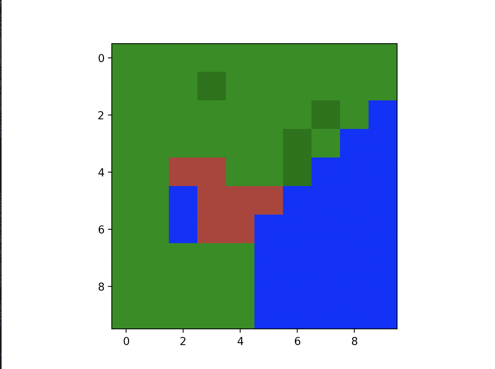
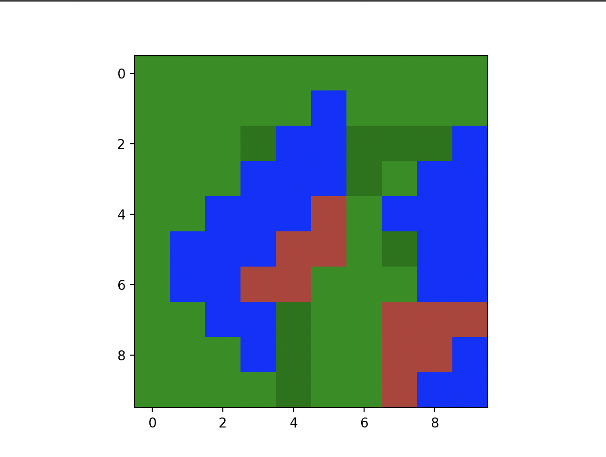
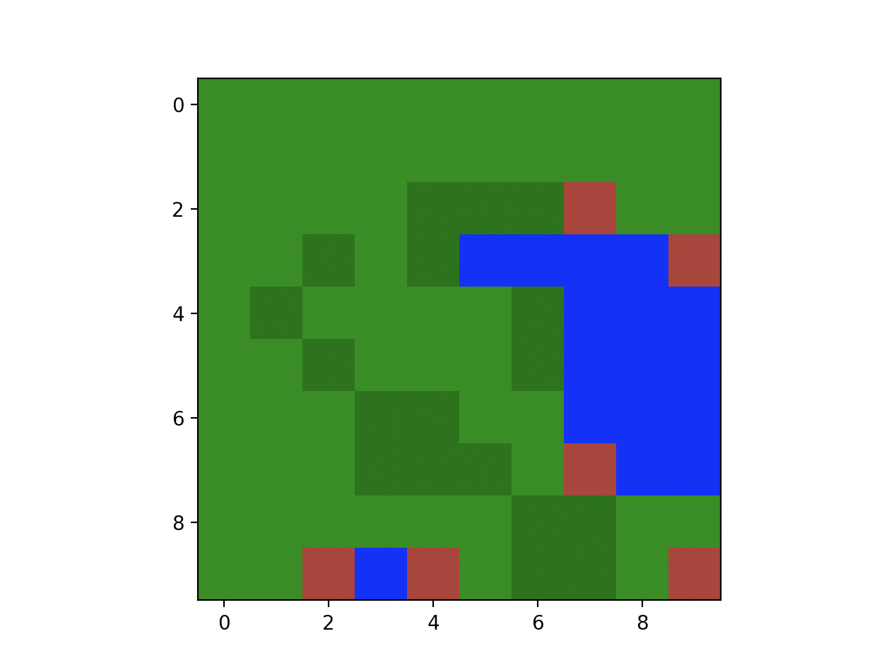

# Developing a Model of the Enviornment for Fire Emblem: The Blazing Blade

## Simplications

For brevity sake, I'll simplify some of the rules of Fire Emblem to make RL simplier:

- Weapon and staff durability is a non concern; they effectively will have ∞ durability. The only items that can be broken are consumables such as vulneraries or elixers.
- No unit support bonuses in combat.
- No S rank bonuses for weapons in combat.
- No tactician bonus in combat
- Agents are limited to 3 actions after moving:
  - Attack (if valid)
  - Item (if valid)
  - Wait
- Typically maps in Fire Emblem can have varying goals. For example, some objectives are to route all enemies, some are to capture a certain point, some are to survive until a turn count...
  - Let's just get rid of all those conditions and just say the goal of every map is to route all enemies. That typically will move the game towards the goal anyways in most conditions. 
- No EXP / WEXP / level gain will be gotten. 
- Weapon experience is not relevant
- Maps with weather effects will not be considered.
- Maps with fog of war will not be considered
- Maps that typically have a outdoor structure with mountains/plains/forests will exclusively be considered and tested on

## Structure of a Unit

Based on the underlying memory representation of a unit, we can make a guess about how a unit is represented as a "struct" in memory (if we theorize that the GBA games were written in a C like language, or C)

We can also analyze old posts on forums such as the GameFAQs (https://gamefaqs.gamespot.com/gba/468480-fire-emblem/faqs/31542) that contain memory addresses for things such as cheat codes in order to infer how units are represented:

```C
struct Unit
{
    int portraitCode;
    int classCode;
    int level;
    int experience;
    int horizontalPosition;
    int verticalPosition;

    int maxHP;
    int currentHP;
    int strength;
    int skill;
    // .. Other stats such as speed

    struct Inventory inventory;

    // .. other stuff
};

```

We need to translate this into a Python unit class that hold all this information with some extra stuff needed

```python
class Unit:
    def __init__(self, character_code, x, y, level, job_code, hp_max,
                 strength, skill, spd, luck, defense, res, magic, ally,
                 inventory_codes: list, terminal_condition):
        self.terminal_condition = terminal_condition

        self.character_code = character_code
        self.x = x
        self.y = y
        self.level = level
        self.hp_max = hp_max
        self.current_hp = hp_max
        self.strength = strength
        self.magic = magic
        self.skill = skill
        self.speed = spd
        self.luck = luck
        self.defense = defense
        self.res = res

        self.inventory = item.construct_unit_inventory(inventory_codes)

        self.name = feutils.character_name_table(self.character_code)
        self.job = feutils.class_table(job_code)
        self.move = feutils.movement_table(self.job)
        self.terrain_group = feutils.job_terrain_group(self.job)

        if ally:
            self.con = feutils.character_constitution_table(self.name)
        else:
            self.con = feutils.job_constitution_table(self.job)
```
Most of these are self explanatory. Some clarifications:

`self.terminal_condition` - Sets if the unit is a "terminal condition" unit. A **terminal condition unit** is defined as a unit that, upon death, causes an instant loss for their associated team. In game, this typically functions as a loss condition for the "allies" team - if one of the main characters such as Lyn, Eliwood, or Hector dies, then it results in an immediate game over. 

`self.inventory` - A list of items that the unit currently has on them. Includes weapons and consumables. 

`self.move` - The maximum manhattan distance that this unit can travel on the board. This will be important in figuring out where the unit can move on a given map.

`self.terrain_group` - Detemines the unit's **terrain group**, which is used to determine how much certain tiles cost to move through. 

## Lookup Tables

There are... a lot of lookup tables. Mainly for translating bytes into usable dictionaries for Python. These are defined in `feutils.py` and the `jsons/` folder in the root of the repository. Mainly for terrain data, item data, weapon data, unit name/class data, etc. 

## Map Generation

Fire Emblem 7 has over 32 unique maps used throughout the game. This number is not sufficient to train a diversely trained RL agent without overfitting. It would be much better to generate maps for training data that are randomly populated with terrain and enemies in a reasonable way.

### Terrain

There are a few terrain generation algorithms out there we could use to generate the terrain data. For simplicity sake, let's use Conway's Game of Life alogrithm. https://en.wikipedia.org/wiki/Conway%27s_Game_of_Life This is easy to implement, fairly performative, and generates reasonable maps. `map_factory.py` contains the relevnant code to generate a map. 

```python
class OutdoorMapFactory:
    """
    Generates an outdoor style map utilizing 3 map layer factories and combines them
    """
    def __init__(self, x_min, x_max, y_min, y_max):
        self.x_min, self.x_max = x_min, x_max
        self.y_min, self.y_max = y_min, y_max

        self.grass_water_factory = MapLayerFactory(5, 2, 7, 3, 8)
        self.forest_factory = MapLayerFactory(4, 2, 6, 4, 7)
        self.mountain_factory = MapLayerFactory(2, 3, 8, 3, 8)
```

First we generate a factory object that contains MapLayerFactory objects. These MapLayerFactorys generate individual components of the maps, namely the grass/water, forests, and mountains.

We call the `generate_map` function to utilize these three factories to generate binary maps, and then combine them according to some basic rules:

```python
# in map_factory.generate_map:

for i in range(x):
    for j in range(y):
        #Alive represents lake, dead represents plains
        if grass_water_grid[i, j]:
            final_map[i, j] = 'Lake'
            number_map[i, j] = 1
        else:
            final_map[i, j] = 'Plain'
            number_map[i, j] = 0

        if final_map[i, j] == 'Plain' and forest_grid[i, j]:
            final_map[i, j] = 'Forest'
            number_map[i, j] = 2

        if final_map[i, j] != 'Lake' and mountain_grid[i, j]:
            final_map[i, j] = 'Mountain'
            number_map[i, j] = 3

return Map(x, y, final_map), number_map
```

This generates nice looking maps that could *reasonably* be found in a Fire Emblem game.

(Brown tiles represent mountains; Blue tiles represent water; light green tiles represent grass/plains; dark green tiles represent forest)







### Unit movement

One important factor is that we need to figure out what tiles are valid that a unit can move to given their movement class, move stat, and the tile map. We need to generate a list of valid coordinates (as tuples) in a single function.

The pseudocode for this can be done nicely recursively. Essentially we create a set of coordinates (as to not allow duplicate coordinates) that is initialized with the unit's x and y coordinate (the tile the unit is standing on is always a valid move position) Then we call separate recursive function 4 times that examine the tiles at x + 1, x - 1, y + 1, y - 1. Within the recursive function we get the cost to move through the tile associated with the movement class and add it to the accumulated cost thus far. If the accumulated cost is ever greater than the unit's movement, we return. Otherwise, we (attempt to) add the coordinates to the set. Then we recurse again 4 times, examining x + 1, x - 1, y + 1, and y - 1. 

```python
    def get_valid_move_coordinates(self, unit):
        movement = unit.move
        terrain_group = unit.terrain_group

        # The tile the unit is standing on is always assumed to be a valid move tile.
        valid_tiles = {(unit.x, unit.y)}

        self.__calculate_tile__(unit.x + 1, unit.y, movement, terrain_group, 0, valid_tiles)
        self.__calculate_tile__(unit.x - 1, unit.y, movement, terrain_group, 0, valid_tiles)
        self.__calculate_tile__(unit.x, unit.y + 1, movement, terrain_group, 0, valid_tiles)
        self.__calculate_tile__(unit.x, unit.y - 1, movement, terrain_group, 0, valid_tiles)

        return valid_tiles

    def __calculate_tile__(self, x, y, movement, terrain_group, accumulated_cost, valid_tiles):
        accumulated_cost += self.grid[x][y].get_unit_cost(terrain_group)

        if accumulated_cost > movement:
            return

        if x < 0 or x >= self.x:
            return

        if y < 0 or y >= self.y:
            return

        valid_tiles.add((x, y))

        self.__calculate_tile__(x + 1, y, movement, terrain_group, accumulated_cost, valid_tiles)
        self.__calculate_tile__(x - 1, y, movement, terrain_group, accumulated_cost, valid_tiles)
        self.__calculate_tile__(x, y + 1, movement, terrain_group, accumulated_cost, valid_tiles)
        self.__calculate_tile__(x, y - 1, movement, terrain_group, accumulated_cost, valid_tiles)

```

While this works, the implementation is slightly naive and inefficient. Under the current implementation, we revisit tiles constantly, which incurs more function call overhead, as well as the overhead for trying to add duplicate coordinates. This may be a place to visit for optimzation later in the semester if the RL agent is training slowly. 

### Unit placement

todo

## Combat Simulation

Now that we can generate maps as well as unit representation, we can run combat simulations. Most formulas have been taken from https://serenesforest.net/blazing-sword/miscellaneous/calculations/ with the simplifications mentioned above. 

---

<i><p align="center">Unit's Attack Speed</p></i>
<b><p align="center">AS = Speed - max((W - Con), 0)</p></b>
<p align="center">Where<br>W = Equipped weapon weight<br>
<br>

---

<i><p align="center">Weapon and Magic Triangle</p></i>
<b><p align="center">Sword > Axe > Lance > Sword</p></b>
<b><p align="center">Anima > Light > Dark > Anima</p></b>
<p align="center">Where '>' means 'is good against'</p>
<p align="center">Positive weapon bonuses get +15%/+1 avoid/def bonus</p>
<p align="center">Negative weapon bonuses get -15%/-1 avoid/def bonus</p>
<br>

---

<i><p align="center">Unit Accuracy</p></i>
<b><p align="center">A = WH + (Skill * 2) + (Luck / 2) + Δ</p></b>
<p align="center">Where<br> WH = Weapon Hit Accuracy,<br>Δ = Weapon triangle bonus, if any </p>
<br>

---

<i><p align="center">Unit Avoid</p></i>
<b><p align="center">Av = (AS * 2) + (Luck / 2) + B</p></b>
<p align="center">Where<br> AS = Attack Speed<br>B = Terrain avoid bonus, if any </p>
<br>

---

<i><p align="center">Hit Chance</p></i>
<b><p align="center">HC = A<sub>a</sub> - Av<sub>d</sub></p></b>
<p align="center">Where<br>  A<sub>a</sub> = Attacker's accuracy<br>Av<sub>d</sub> = Defender's avoid </p>
<br>

---

<i><p align="center">Attack Damage</p></i>
<p align="center">IF PHYSICAL:</p>
<b><p align="center">A<sub>P</sub> = Strength + WM + Δ</p></b>
<p align="center">Where<br>  WM = Weapon might<br>Δ = Triangle might bonus </p>
<br>
<p align="center">IF MAGICAL:</p>
<b><p align="center">A<sub>M</sub> = Magic + WM + Δ</p></b>
<p align="center">Where<br>  WM = Weapon might<br>Δ = Triangle might bonus </p>
<br>

---

<i><p align="center">Defense</p></i>
<p align="center">IF PHYSICAL:</p>
<b><p align="center">D<sub>P</sub> = Defense + B</p></b>
<p align="center">Where<br>  B = Terrain defense bonus, if any might</p>
<br>
<p align="center">IF MAGICAL:</p>
<b><p align="center">D<sub>M</sub> = Resistance + B</p></b>
<p align="center">Where<br>B = Terrain defense bonus, if any might</p>
<br>

---

<i><p align="center">Might</p></i>
<p align="center">IF PHYSICAL:</p>
<b><p align="center">M<sub>P</sub> = A<sub>AP</sub> - D<sub>DP</sub></p></b>
<p align="center">Where<br>  A<sub>AP</sub> = Attacker's Physical attack damage<br>D<sub>DP</sub> = Defender's Physical defense</p>
<br>
<p align="center">IF MAGICAL:</p>
<b><p align="center">M<sub>M</sub> = A<sub>AM</sub> - D<sub>DM</sub></p></b>
<p align="center">Where<br>  A<sub>AM</sub> = Attacker's magical attack damage<br>D<sub>DM</sub> = Defender's magical defense</p>
<br>

---

<i><p align="center">Critical Hit Rate</p></i>
<b><p align="center">CR = WC + (Skill / 2) + J</p></b>
<p align="center">Where<br>WC = Weapon crit<br>J = Job bonus <br>(If the unit's job is swordmaster or berserker, then add +15% to critial hit rate) </p>
<br>

---

<i><p align="center">Critical Avoid Rate</p></i>
<b><p align="center">CA = Luck / 2 </p></b>
<br>

---

<i><p align="center">Critical Chance</p></i>
<b><p align="center">C = CR<sub>A</sub> - CA<sub>D</sub></p></b>
<p align="center">Where<br>CR<sub>A</sub> = Crit rate of attacker<br>CA<sub>D</sub> = Crit avoidance of defender</p>
<br>

### A note on Combat Randomness

Starting from Fire Emblem 6, combat randomness in Fire Emblem is not rolled once. Instead, the game rolls two random numbers and then averages them together.

```python
def roll_random_chance():
    n = random.random()
    k = random.random()
    return (n + k) / 2
```

The effect of this creates a *sigmoid* function for the randomess in the games. What this means is that percentages below 50% are much less likely to hit than they are supposed to, and random percentages above 50% are much more likely to hit than they are supposed to. 

While not perfectly mathmatically sound, this generates a sort of "close enough" that can generally favor the player; player controlled units tend to have a much higher hit rate than enemies, so ultimately this benefits the player. This was likely done by designers in order to limit RNG frusturation with players.