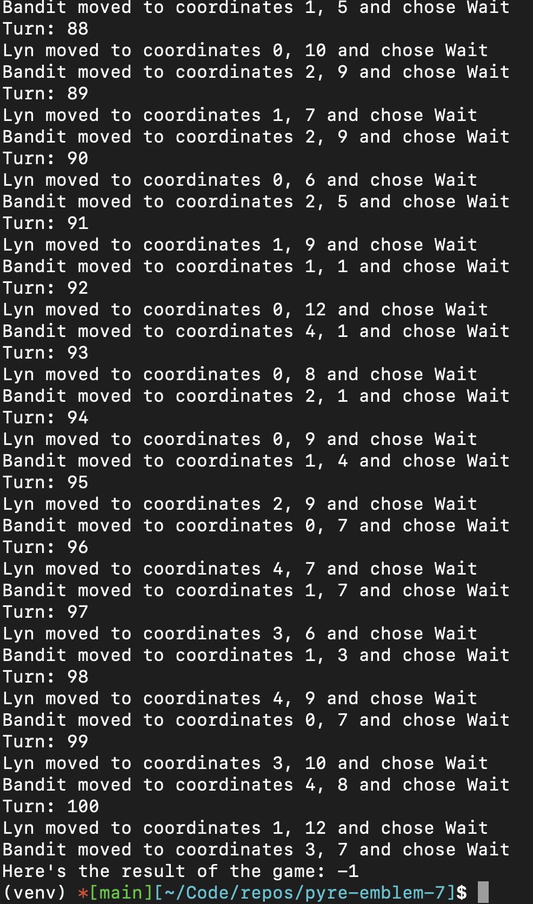

# Simulating and Visualization of the Enviornment 

Our goal within this time frame was to actually simulate the game and have it be visualized on screen in the form of a GUI. I will be using Tkinter to develop the GUI since it ships with Python by default and is fairly easy to get up and running. It'll also be perfectly capable of doing the basic functionality I need (some buttons and drawing some shapes)

## Simulating the Enviornment

I had two iterations of the `FireEmblem` class. The first one was good for console use, but I realized a little late that it wasn't going to be compatible with a GUI. We'll get to that :) The 2nd one follows a more incremental approach to the simulation which makes it easier for the GUI to render, step, render over and over.


### class FireEmblem v1

The FireEmblem class in `game.py` is essentially a view of the entire enviornment in the game. We want to know the tile map, the ally team, the enemy team, who makes the decisions for those teams, and the current turn count. We also want to know if we encountered a win/loss condition. 

```python
class FireEmblem:
    def __init__(self, tile_map: Map, blue_team: list, red_team: list, blue_player: Player, red_player: Player):
        self.map = tile_map
        self.allies = blue_team
        self.enemies = red_team
        self.ally_controller = blue_player
        self.enemy_controller = red_player
        self.turn_count = 0
        self.loss_condition_encountered = False
        self.win_condition_encountered = False
```

The allies and enemies are lists of Units that describes each team (as described in earlier research). The controllers are a new class that will, hypothetically, in the future, decide what actions to take. Right now they are making totally random actions; their implementation is pretty simple.

```python
class Player(ABC):
    @abstractmethod
    def determine_move_coordinates(self, friend_units, enemy_units, tile_map: Map, this_unit):
        pass

    @abstractmethod
    def determine_action(self, enemy_units, tile_map: Map, this_unit, x, y):
        pass


class RandomPlayer(Player):
    def determine_move_coordinates(self, friend_units, enemy_units, tile_map: Map, this_unit):
        valid_moves = tile_map.get_valid_move_coordinates(this_unit, friend_units, enemy_units)
        return random.choice(valid_moves)

    def determine_action(self, enemy_units, tile_map: Map, this_unit, x, y):
        potential_actions = tile_map.valid_actions_at_position(this_unit, enemy_units, x, y)
        return random.choice(potential_actions)
```

Now that we have controllers that can make actions based on the state of the game, we can actually run through a game of Fire Emblem purely through the simulation.

In the first iteration, we had a simple function, `run()`, that runs through an entire game of Fire Emblem. The return value represented either a victory (1) or a loss (-1). Notice we also have a hard turn limit at turn 100, which will result in a loss for the allied team. This is mainly just to stop the AI if it's clearly making bad/random decisions as to not waste time/processing power. 

```python
    def run(self):
        while not self.loss_condition_encountered and not self.win_condition_encountered:
            self.turn_count += 1

            self.player_phase()

            if self.win_condition_encountered:
                return 1
            elif self.loss_condition_encountered:
                return -1

            self.enemy_phase()

            if self.turn_count == 100:
                self.loss_condition_encountered = True

            if self.win_condition_encountered:
                return 1
            elif self.loss_condition_encountered:
                return -1

```

`self.player_phase()` and `self.enemy_phase()` are nearly identical:

```python

    def player_phase(self):
        for unit in self.allies:
            new_coords = self.ally_controller.determine_move_coordinates(self.allies, self.enemies, self.map, unit)
            unit.goto(new_coords[0], new_coords[1])
            action_choice = self.ally_controller.determine_action(self.enemies, self.map, unit, unit.x, unit.y)

            if action_choice.is_attack():
                # Defender in this case is from self.enemies
                defender = action_choice.action_item
                combat_stats = combat.get_combat_stats(unit, defender, self.map)
                result = combat.simulate_combat(combat_stats)

                if result is CombatResults.DEFENDER_DEATH:
                    self.enemies.remove(defender)
                    if not self.enemies:
                        self.win_condition_encountered = True

                elif result is CombatResults.ATTACKER_DEATH:
                    if unit.terminal_condition:
                        self.loss_condition_encountered = True
                    self.allies.remove(unit)

            elif action_choice.is_item():
                item_to_use = action_choice.action_item
                heal_amount = item_to_use.info['heal_amount']
                unit.heal(heal_amount)
                item_to_use.info['uses'] -= 1
                if item_to_use.info['uses'] == 0:
                    unit.inventory.remove(item_to_use)

```

If the agent choses to attack, we simply simulate combat, otherwise if the agent chose to use an item we use it. Otherwise, we just wait. It's important to note that `self.ally_controller.determine_action` is responsible for generating that list of potential actions at a given position. 

After ironing out a few bugs and running through the console, the program runs pretty well! Albeit the decisions aren't intelligent at all, but regardless, simulating the enviornment works. 

